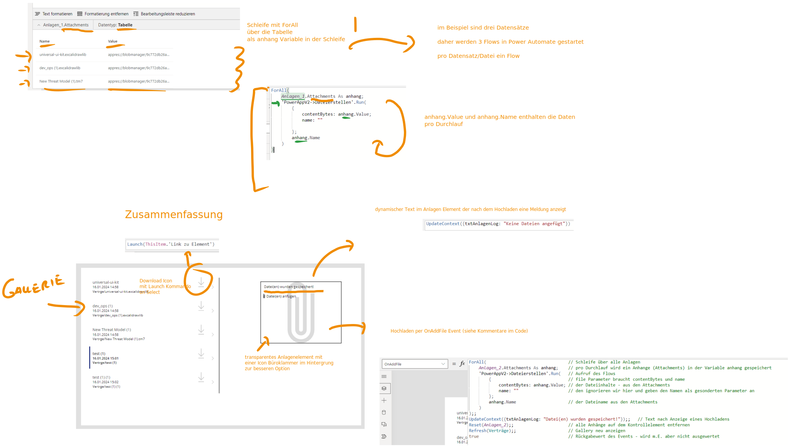
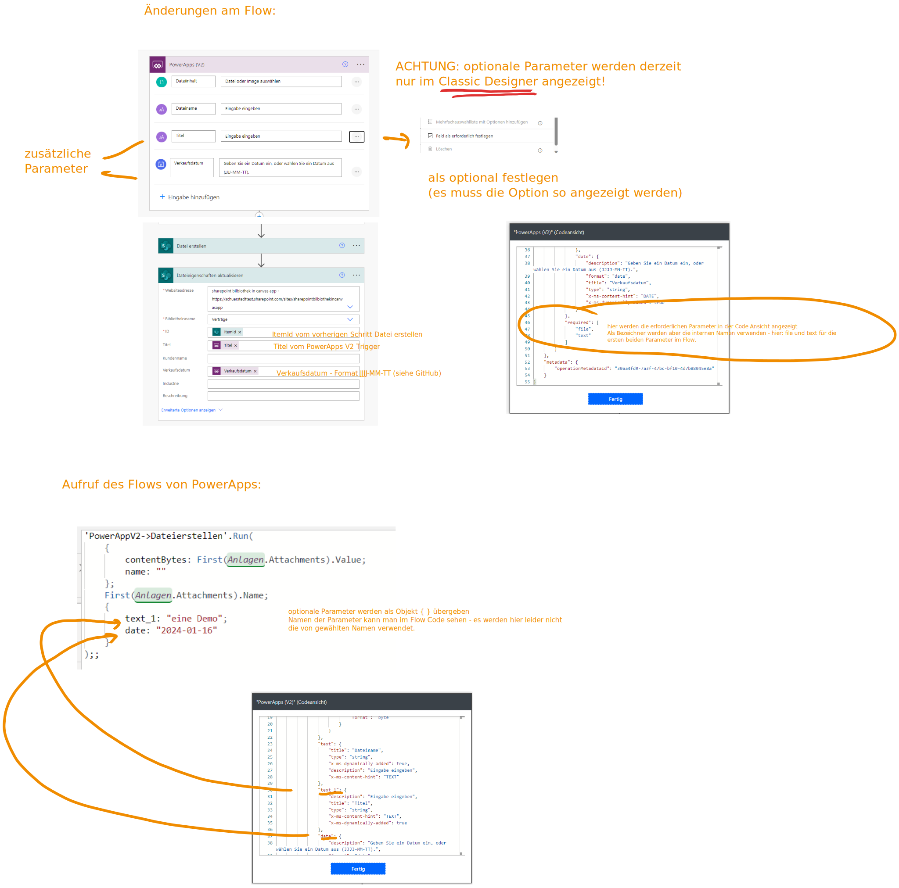

# Hochladen von Dateien in eine Sharepoint-Bibliothek-in-Canvas-Apps

Dieses Videos beschreiben wie man Dateien in einer Sharepoint Bibliothek von einer Canvas App innerhalb der Standard Lizenz hochladen kann.

# Referenz

basierend auf dem Blog Post von Matthew Devaney (Prädikat besonders empfehlenswert)

https://www.matthewdevaney.com/power-apps-easiest-way-to-upload-files-to-a-sharepoint-document-library/

# Teil 1 - eine Datei hochladen


# Teil 2 - mehrere Dateien hochladen



Skript zum Hochladen:

```
ForAll(                                 // Schleife über alle Anlagen
    Anlagen_2.Attachments As anhang;    // pro Durchlauf wird ein Anhange (Attachments) in der Variable anhang gespeichert
    'PowerAppV2->Dateierstellen'.Run(   // Aufruf des Flows
        {                               // file Parameter braucht contentBytes und name
            contentBytes: anhang.Value; // der Dateiinhalte - aus den Attachments 
            name: ""                    // den ignorieren wir hier und geben den Namen als gesonderten Parameter an
        };
        anhang.Name                     // der Dateiname aus den Attachments
    )
);;
UpdateContext({txtAnlagenLog: "Datei(en) wurden gespeichert!"});;   // Text nach Anzeige eines Hochladens
Reset(Anlagen_2);;                      // alle Anhänge auf dem Kontrollelement entfernen
Refresh(Verträge);;                     // Gallery neu anzeigen
true                                    // Rückgabewert des Events - wird m.E. aber nicht ausgewertet
```

# Teil 3 - Metadaten bearbeiten


