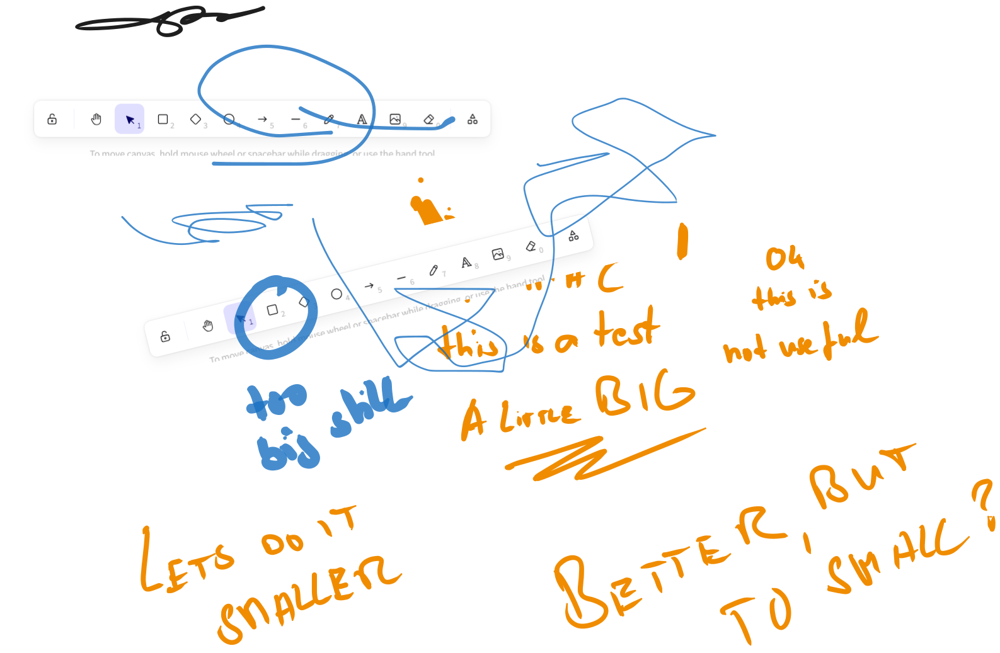
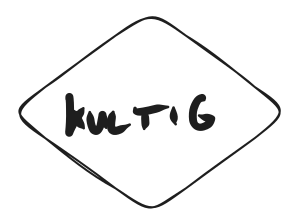

# Sharepoint-Bibliothek-in-Canvas-Apps

Sharepoint Bibliothek in Canvas Apps

## ein neuer Punkt

und nun?

## Machen wir ein neues Bild

## und nun noch ein Link

hier ist die url: [https://github.com/Power-Platform-Deutsch/Sharepoint-Bibliothek-in-Canvas-Apps/](https://github.com/Power-Platform-Deutsch/Sharepoint-Bibliothek-in-Canvas-Apps/)

https://github.com/Power-Platform-Deutsch/Sharepoint-Bibliothek-in-Canvas-Apps/

hmmm, ein wenig umständlich, aber ok :)

wird aber beides als Link angezeigt - nun ja, so soll es ja sein

| test1                                                    | test2               | test3             |
| -------------------------------------------------------- | ------------------- | ----------------- |
| jd fj slkdfj lksdj fl kl lk jklj lk  lkj lk j |                     |                   |
|                                                          | dskjfgh fdjkg dfjkg | skjgh jksh fkjs f |
