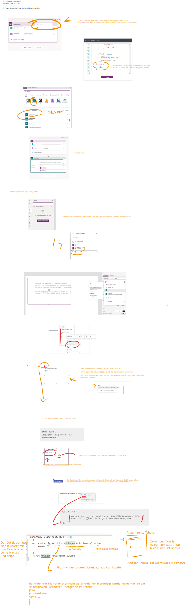

# Hochladen von Dateien in eine Sharepoint-Bibliothek-in-Canvas-Apps

Dieses Videos beschreiben wie man Dateien in einer Sharepoint Bibliothek von einer Canvas App innerhalb der Standard Lizenz hochladen kann.

# Referenz

basierend auf dem Blog Post von Matthew Devaney (Prädikat besonders empfehlenswert)

https://www.matthewdevaney.com/power-apps-easiest-way-to-upload-files-to-a-sharepoint-document-library/

# Teil 1 - eine Datei hochladen

*Achtung: der Flow muss im Classic Designer angelegt werden, da ansonsten der File Parameter als optional defininiert wird und der Aufruf von PowerApps aus nicht funktioniert. Im neuen Designer kann diese Option derzeit noch nicht gesetzt werden.*

Link zum Video: https://youtu.be/AbRa6_sgqTg 



# Teil 2 - mehrere Dateien hochladen

Link zum Youtube Video https://youtu.be/5WV59Xq5v3c


Skript zum Hochladen:

```
ForAll(                                 // Schleife über alle Anlagen
    Anlagen_2.Attachments As anhang;    // pro Durchlauf wird ein Anhange (Attachments) in der Variable anhang gespeichert
    'PowerAppV2->Dateierstellen'.Run(   // Aufruf des Flows
        {                               // file Parameter braucht contentBytes und name
            contentBytes: anhang.Value; // der Dateiinhalte - aus den Attachments 
            name: ""                    // den ignorieren wir hier und geben den Namen als gesonderten Parameter an
        };
        anhang.Name                     // der Dateiname aus den Attachments
    )
);;
UpdateContext({txtAnlagenLog: "Datei(en) wurden gespeichert!"});;   // Text nach Anzeige eines Hochladens
Reset(Anlagen_2);;                      // alle Anhänge auf dem Kontrollelement entfernen
Refresh(Verträge);;                     // Gallery neu anzeigen
true                                    // Rückgabewert des Events - wird m.E. aber nicht ausgewertet
```

# Teil 3 - Metadaten bearbeiten

Link zum Youtube Video https://youtu.be/kgTa8DOIUuI

Im 3. Teil schauen wir uns an, wie wir den Flow dahingehend ändern, dass Metadaten gespeichert werden.


## Hier die Code Ansicht vom Flow:

```
{
    "kind": "PowerAppV2",
    "inputs": {
        "schema": {
            "type": "object",
            "properties": {
                "file": {
                    "title": "Dateiinhalt",
                    "type": "object",
                    "x-ms-dynamically-added": true,
                    "description": "Datei oder Image auswählen",
                    "x-ms-content-hint": "FILE",
                    "properties": {
                        "name": {
                            "type": "string"
                        },
                        "contentBytes": {
                            "type": "string",
                            "format": "byte"
                        }
                    }
                },
                "text": {
                    "title": "Dateiname",
                    "type": "string",
                    "x-ms-dynamically-added": true,
                    "description": "Eingabe eingeben",
                    "x-ms-content-hint": "TEXT"
                },

               "text_1": {
                    "description": "Eingabe eingeben",
                    "title": "Titel",
                    "type": "string",
                    "x-ms-content-hint": "TEXT",
                    "x-ms-dynamically-added": true
                },
                "date": {
                    "description": "Geben Sie ein Datum ein, oder wählen Sie ein Datum aus (JJJJ-MM-TT).",
                    "format": "date",
                    "title": "Verkaufsdatum",
                    "type": "string",
                    "x-ms-content-hint": "DATE",
                    "x-ms-dynamically-added": true
                }
            },
            "required": [
                "file",
                "text"
            ]
        }
    },
    "metadata": {
        "operationMetadataId": "30aa4fd9-7a3f-47bc-bf10-4d7b88045e8a"
    }
}
```

## Hier der Aufruf in PowerApps:

```
'PowerAppV2->Dateierstellen'.Run(
    {
        contentBytes: First(Anlagen.Attachments).Value;
        name: ""
    };
    First(Anlagen.Attachments).Name;
    {
        text_1: "eine Demo";
        date: "2024-01-16"
    }
);;

```
